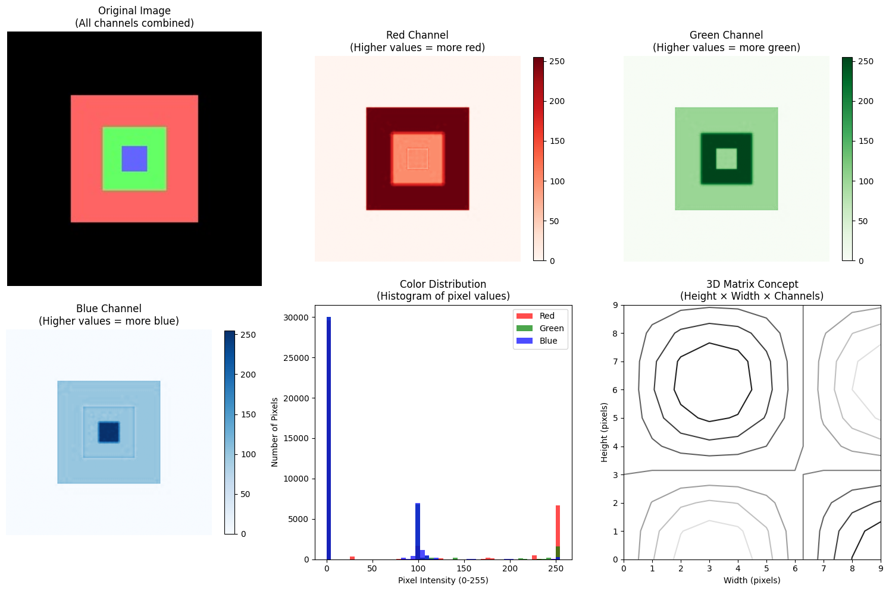
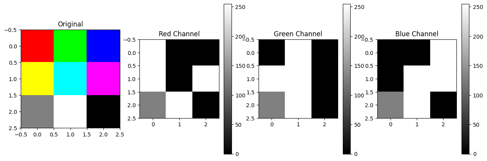
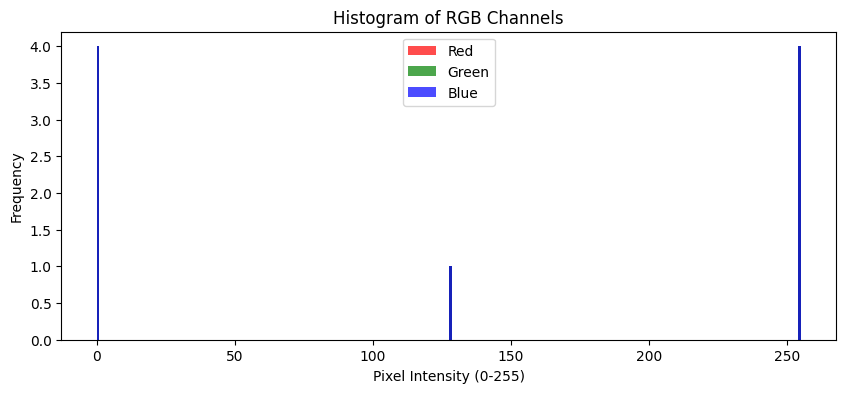
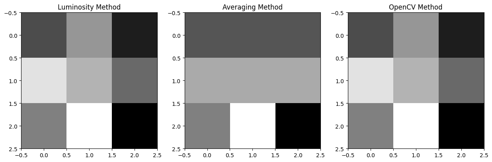
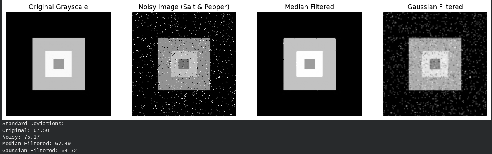
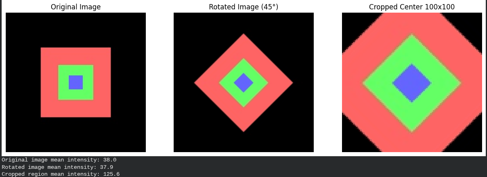
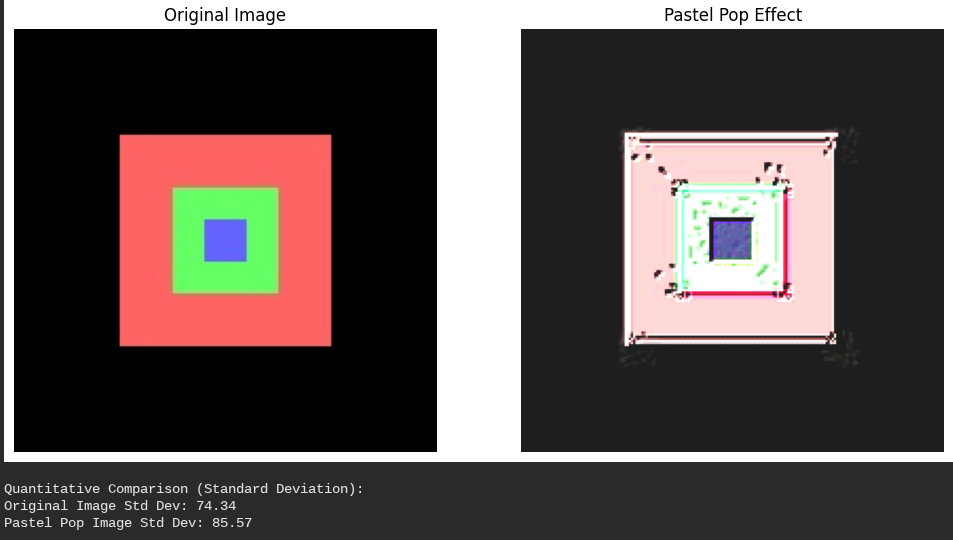
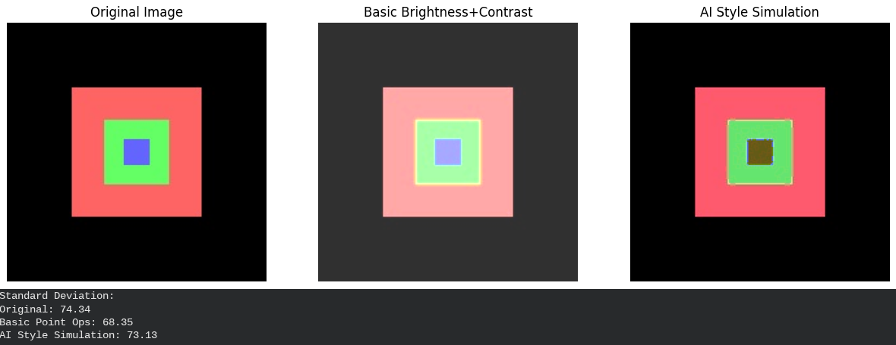
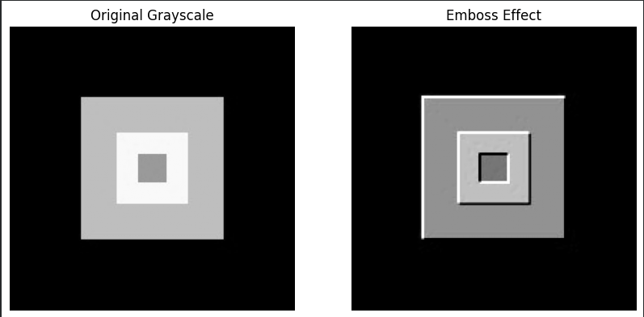
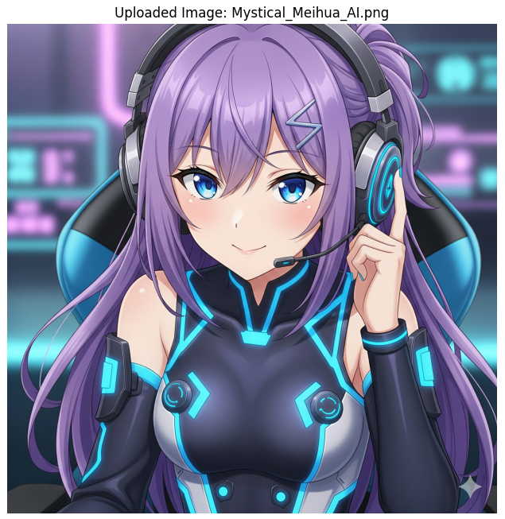

# Image Processing Fundamentals




## Project Overview
**Module:** 02 - Core Image Operations

**Topic:** Pixel Manipulation, Filtering, and Transformation

**Framework:** OpenCV, NumPy, Matplotlib

This project explores the fundamental building blocks of Computer Vision. Before diving into deep learning, it is crucial to understand how images are represented as matrices of numbers and how mathematical operations can be used to enhance, transform, and analyze them. This project involves deep experimentation with color spaces, histogram equalization, noise reduction filters, and geometric transformations.

## Problem Statement
Raw digital images often suffer from imperfections such as poor lighting (low contrast), sensor noise (salt-and-pepper), or misalignment.
* **The Challenge:** Improving image quality and extracting features using only mathematical operations (no neural networks).
* **The Goal:** To master the manipulation of pixel values, understand the frequency domain (histograms), and apply convolution kernels for spatial filtering.

## Approach & Methodology

### 1. Pixel-Level Manipulation
* **Arithmetic Operations:** Explored addition/subtraction for brightness adjustment.
* **Bitwise Operations:** Used masking to isolate regions of interest.

### 2. Analysis & Enhancement
* **Histograms:** Analyzed pixel intensity distributions.
* **Equalization:** Applied Histogram Equalization to stretch the contrast of washed-out images (demonstrated in the "Mystical Meihua" challenge).

### 3. Filtering & Restoration
* **Noise Reduction:** Compared **Gaussian Blur** (linear) vs. **Median Blur** (non-linear) to handle specific types of noise.
* **Custom Kernels:** Designed custom convolution matrices to create effects like **Embossing**.

### 4. Geometric Transformations
* **Affine Transforms:** Implemented rotation, translation, and scaling matrices.
* **Interpolation:** Managed pixel rendering during rotation to maintain quality.

## Key Results & Visualizations

### Personal Experiments (In-Depth Exploration)

#### Experiment 1: Color Channel Dynamics
I manipulated the RGB channels independently to understand how color composition works.
* **Method:** Swapped channels (Red $\leftrightarrow$ Blue) and analyzed the resulting histogram shifts.

| Channel Swap 1 | Channel Swap 2 | Histogram Analysis |
|:---:|:---:|:---:|
|  |  |  |

#### Experiment 2: Denoising Strategy
* **Objective:** Remove "Salt-and-Pepper" noise.
* **Finding:** The **Median Filter** outperformed the Gaussian filter because it replaces outliers with the median value, preserving edges, whereas Gaussian blur simply smeared the noise.



#### Experiment 3: Geometry & Cropping
* **Objective:** Rotate an image at an arbitrary angle without introducing black borders.
* **Result:** Calculated the new bounding box dimensions to crop the center effectively.



#### Experiment 4 & 5: Creative Filters
* **Pastel Pop:** Combined saturation boosting with smoothing to create a "cartoonish" effect.
* **AI Style Sim:** Mimicked artistic style transfer using basic point operations.

| Pastel Pop Filter | AI Style Simulation |
|:---:|:---:|
|  |  |

---

### Key Challenges

#### Challenge 1: Custom Filter Design
I designed a custom **Emboss Kernel** to highlight edges and give the image a 3D relief effect.
* **Kernel Used:** `[[-2, -1, 0], [-1, 1, 1], [0, 1, 2]]`



#### Challenge 2: Histogram Equalization (Mystical Meihua)
* **Problem:** The original uploaded "Mystical Meihua" image was too dark, with details hidden in shadows.
* **Solution:** Applied Histogram Equalization to flatten the intensity distribution, revealing the hidden details.

| Original Upload | Equalized Result & Histogram |
|:---:|:---:|
|  |  |

## Key Findings
1.  **Filter Selection Matters:** Median filtering is superior for impulse noise (salt-and-pepper), while Gaussian is better for random signal noise.
2.  **Histograms are Diagnostic:** You cannot fix contrast blindly; the histogram tells you exactly where the pixel intensities are bunched up.
3.  **Math is Art:** Simple matrix multiplications (Affine transforms) and convolutions (Filtering) are the core of all visual effects, from Photoshop to Instagram filters.

## Technologies Used
* **Python 3.8+**
* **OpenCV (cv2):** Core image processing operations.
* **NumPy:** Matrix manipulation.
* **Matplotlib:** Displaying images and histograms side-by-side.

## Project Structure

```text
Project-02-Image-Processing-Fundamentals/
├── P02_Image-Processing-Fundamentals.ipynb     # Main Jupyter Notebook Code
├── P02_PF_Image-Processing-Fundamentals.pdf    # Project Report (Print Version)
├── J02_RF_Image-Processing-Fundamentals.pdf    # Reflection Journal
├── README.md                                   # Project Documentation
└── Results-&-Visualizations/
    ├── Challenge_1-Custom_Emboss_Filter_Design.png
    ├── Challenge_2-Uploaded_Image_Mystical_Meihua_AI.png
    ├── Challenge_2_Uploaded_Image_Mystical_Meihua_AI_Original_Grayscale_&_Historgram_Equalized.png
    ├── Personal_Experiment_1-Color_Channel_Swap_and_Histogram_Analysis_1-image.png
    ├── Personal_Experiment_1-Color_Channel_Swap_and_Histogram_Analysis_2-image.png
    ├── Personal_Experiment_1-Color_Channel_Swap_and_Histogram_Analysis_3-image.png
    ├── Personal_Experiment_2-Median_vs_Gaussian_Filtering_on_Salt-and-Pepper_Noise.png
    ├── Personal_Experiment_3-Rotation_at_Arbitrary_Angle_and_Center_Cropping.png
    ├── Personal_Experiment_4-Creative_Exploration-Pastel_Pop_Filter.png
    ├── Personal_Experiment_5-AI_Style_Simulation_vs_Basic_Point_Operations.png
    ├── Part-1_Digital_Image_Fundamentals.png
    ├── Part-2_Basic_Image_Operations.png
    ├── Part-3_Advanced_Processing_Techniques.png                                                    
    ├── Part-4_Combining_Multiple_Operations.png
    ├── Part-5_Understanding_the_Foundation_of_AI_Image_Processing.png
    ├── Converting_to_Grayscale.png
    ├── Exploring_RGB_Channels.png
    ├── Exploring_RGB_Channels_Channel_statistics.png
    ├── Image-Shape_Data_Type_Value_Range_Number_of_Pixels.png
    ├── Neighborhood_Operations_(Filtering).png
    └── Quantitative_Comparison_(Mean Pixel Value).png
