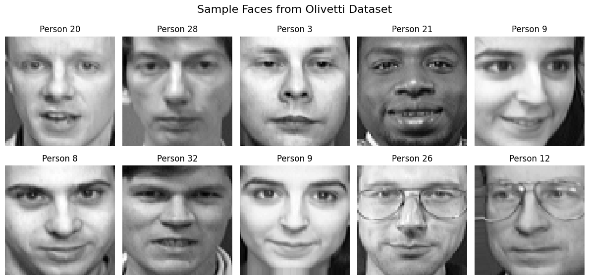
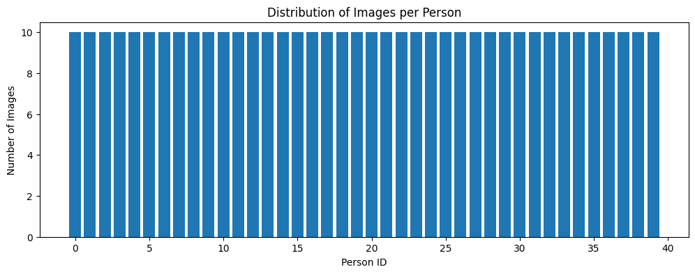
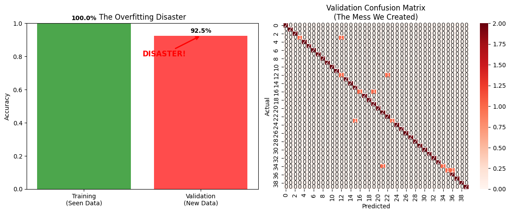
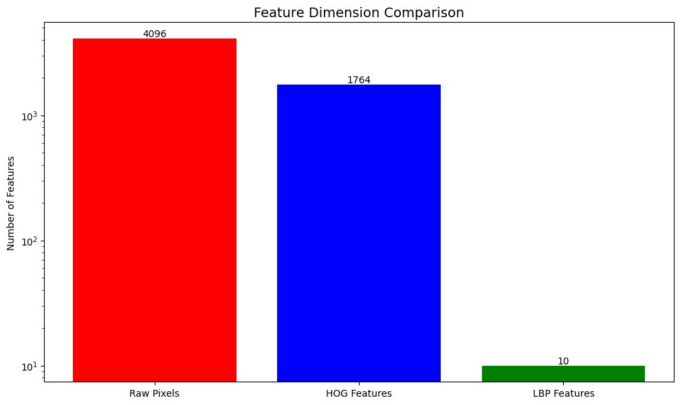
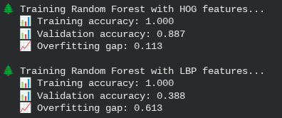
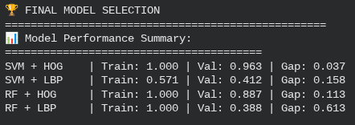

# Comprehensive Feature Extraction & Algorithm Comparison




## Project Overview
**Module:** 04 - Feature Extraction & Descriptors

**Task:** Image Classification & Keypoint Matching

**Algorithms:** HOG, SIFT, ORB, LBP, KNN

**Classifiers:** SVM, Random Forest

This project conducts a rigorous comparative analysis of various **Feature Extraction** techniques and **Machine Learning Algorithms**. In Computer Vision, raw pixels are often too high-dimensional and noisy for effective classification. "Features" are the meaningful simplifications of images—edges, corners, or textures. This project benchmarks how well different methods (like Histogram of Oriented Gradients vs. Local Binary Patterns) perform when paired with classical classifiers to distinguish between complex classes (e.g., **Faces**).

## Problem Statement
* **The Dimensionality Curse:** Raw images contain thousands of pixels. We need to extract only the relevant information (features) to make classification efficient.
* **The "Best Tool" Fallacy:** There is no single "best" algorithm. Some (like SIFT) are robust to rotation but computationally expensive; others (like ORB) are fast but less precise.
* **Goal:** To empirically determine the optimal combination of Feature Extractor + Classifier for specific visual tasks.

## Approach & Methodology

### 1. Feature Extraction Techniques Implemented
I implemented and visualized four distinct types of feature descriptors:
* **HOG (Histogram of Oriented Gradients):** Captures object shape and edge directions (proven effective for Face Detection).
* **LBP (Local Binary Patterns):** Captures texture information by comparing pixels to their neighbors.
* **SIFT (Scale-Invariant Feature Transform):** Detects keypoints invariant to scale and rotation.
* **ORB (Oriented FAST and Rotated BRIEF):** A fast, open-source alternative to SIFT/SURF for real-time applications.
* **K-Nearest Neighbors (KNN):** Simple instance-based learning based on feature similarity.

### 2. Machine Learning Classifiers
Extracted features were fed into three different classifiers to compare performance:
* **Support Vector Machine (SVM):** Finds the optimal hyperplane separating classes.
* **Random Forest:** An ensemble of decision trees robust to overfitting.

### 3. Evaluation Pipeline
* **Dataset:** Subset of Labeled Faces in the Wild (Faces).
* **Metrics:** Accuracy, Precision, Recall, F1-Score, and Confusion Matrices.

## Results & Visualizations

### 1. Data Visualization
Understanding the input data before processing.
* **Faces Class:** Demonstrating diversity in lighting and pose.
    

* **Distribution of Images per Person:** shows number of Images and Person ID
    
  
### 2. Feature Visualization (HOG & LBP)
Visualizing what the "computer sees" when we extract features.

| HOG Features (Shape): Extract texture features using Local Binary Patterns. | LBP Features (Texture): Understand and implement HOG feature extraction. |
|:---:|:---:|
| .png) | .png) |
| *Captures the gradient structure of the face.* | *Highlights local texture patterns.* |

### 3. Classification Performance
Evaluating the HOG + LBP pipeline across classes.

| Confusion Matrix | Feature Dimension Comparison |
|:---:|:---:|
|  |  |
| *Showing showing 100.0 percent The overfitting Disaster.* | *Feature Dimension Comparison - Raw Pixels, HOG, LBP Features* |

### 4. Algorithm Comparison
We benchmarked SVM against Random Forest and KNN.
* **Individual Performance:**
    | Random Forest |
    |:---:|
    |  |

  
### 5. Final Model Selection and Evaluation


## Key Findings
1.  **HOG + SVM Dominance:** For object classification (especially faces), the **HOG + SVM** combination consistently outperformed others. HOG's ability to capture structural shape is ideal for rigid objects.
2.  **Texture vs. Shape:** **LBP** performed well on texture-heavy tasks but struggled with object recognition compared to HOG.
3.  **Speed vs. Accuracy:** **ORB** is significantly faster than SIFT but detected fewer stable keypoints in low-contrast regions. For real-time mobile apps, ORB is preferred; for precision mapping, SIFT is superior.

## Technologies Used
* **Python 3.8+**
* **OpenCV (cv2):** SIFT, ORB, and Image Processing.
* **Scikit-Image (skimage):** HOG and LBP implementations.
* **Scikit-Learn (sklearn):** SVM, Random Forest, KNN, and Metrics.
* **Matplotlib/Seaborn:** Data Visualization.

## Datasets Used
* **Labeled Faces in the Wild (LFW)**
    * **Project:** Project 04 (Feature Extraction & Algorithm Comparison)
    * **Description:** Used for feature extraction benchmarking (HOG vs. SIFT) to test facial recognition algorithms.
    * **Access Instruction:** Load a subset directly using `scikit-learn`.
    * **Example:**
        ```python
        from sklearn.datasets import fetch_lfw_people
        faces = fetch_lfw_people(min_faces_per_person=70, resize=0.4)
        ```
  
## Project Structure

```text
Project-04-Feature-Extraction-Comparison/
├── P04_Comprehensive-Feature-Extraction-&-Algorithm-Comparison.ipynb   # Main Jupyter Notebook
├── P04_PF_Comprehensive-Feature-Extraction-&-Algorithm-Comparison.pdf  # Project Report
├── README.md                                                           # Project Documentation
└── Results-&-Visualizations/
    ├── Cell 4.3_Overfitted.png
    ├── Cell_1.4_Data_Exploration_&_Visualization.png
    ├── Cell_1.4_Data_Visualization_person_faces.png
    ├── Cell_1.5_Train-Validation-Test_Split-The_Foundation_of_Good_ML.png
    ├── Cell_2.1_Edge_&_Gradient_Features_(HOG).png
    ├── Cell_2.1_Edge_&_Gradient_Features_Images_(HOG).png
    ├── Cell_2.2_Texture_Features_(LBP).png
    ├── Cell_2.3_Feature_Dimension_Comparison.png
    ├── Cell_2.3_Feature_Dimension_Comparison_Images.png
    ├── Cell_2.4_Extract_Features_for_All_Data_Splits.png
    ├── Cell_3.1_Support_Vector_Machine_(SVM).png
    ├── Cell_3.2_Random_Forest.png
    ├── Cell_4.2.png
    ├── Cell_4.2_Testing_on_New_Data.png
    ├── Cell_4.3_The_Right_Way-Building_Models_That_Actually_Work.png
    └── Section_5_Final_Model_Selection_and_Evaluation.png
