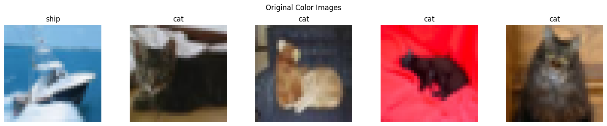
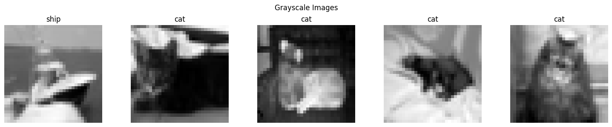
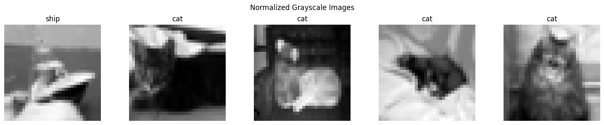
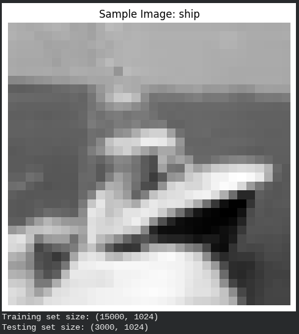
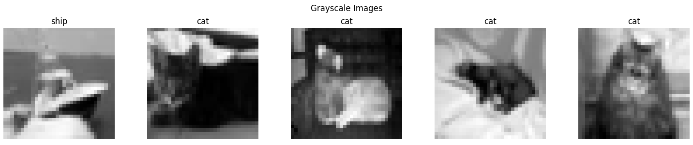
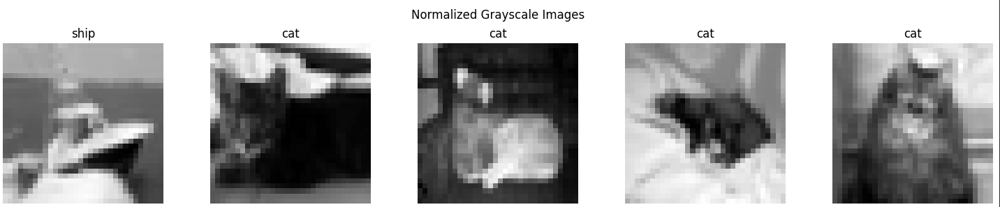
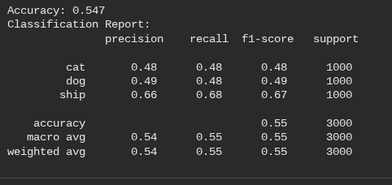

# SVM with Focused Image Classification








## Project Overview
**Module:** 05 - Classical Machine Learning for Vision

**Model:** Support Vector Machine (SVM)

**Dataset:** CIFAR-10 (Subset: Ships vs. Cats/Animals)

This project explores the application of **Classical Machine Learning** techniques to computer vision tasks. Before the deep learning era, models like **Support Vector Machines (SVMs)** were standard for classification. This project implements an SVM classifier to distinguish between specific object categories (e.g., Ships vs. Cats) from the CIFAR-10 dataset, demonstrating the importance of feature engineering and data preprocessing in non-neural network approaches.

## Problem Statement
Image classification is typically handled by Convolutional Neural Networks (CNNs) today. However, understanding classical methods is crucial for grasping the fundamentals of decision boundaries and high-dimensional data spaces.
* **The Challenge:** Raw images are high-dimensional data (32x32x3 pixels = 3,072 features). SVMs struggle with raw pixel data compared to deep learning models.
* **The Goal:** To build an effective classifier using SVM by applying rigorous preprocessing (Grayscale conversion, Normalization) to reduce computational complexity and improve convergence.

## Approach & Methodology

The project follows a standard Machine Learning pipeline adapted for image data:

### 1. Data Preparation (CIFAR-10)
* **Source:** Loaded the CIFAR-10 dataset using Keras/TensorFlow datasets.
* **Filtering:** Extracted a specific subset of classes (e.g., **Ship** and **Cat**) to create a focused binary classification problem.
* **Data Split:** Divided data into Training and Testing sets to evaluate generalization.

### 2. Preprocessing Pipeline
Since SVMs are sensitive to the scale of input data, extensive preprocessing was applied:
1.  **Grayscale Conversion:** Reduced dimensionality by converting RGB images (3 channels) to Grayscale (1 channel).
2.  **Normalization:** Scaled pixel values from the range [0, 255] to [0, 1] to ensure the SVM optimization algorithm converges efficiently.
3.  **Flattening:** Reshaped the 2D image arrays into 1D feature vectors for input into the SVM.

### 3. Model Architecture
* **Algorithm:** Support Vector Machine (SVM).
* **Kernel:** Radial Basis Function (RBF) or Linear (depending on experiment configuration).
* **Task:** Binary Classification (learning the decision boundary/hyperplane between the two classes).

## Results & Visualizations

### 1. Data Exploration
Visualizing the raw data before processing to confirm class integrity.

| Original Color Images | Data Distribution |
|:---:|:---:|
|  |  |
| *Raw RGB inputs from CIFAR-10.* | *Training vs Testing set sizes.* |

### 2. Preprocessing Steps
Visualizing the transformation of data to prepare it for the SVM.

| Step 1: Grayscale Conversion | Step 2: Normalization |
|:---:|:---:|
|  |  |
| *Reducing channels (RGB -> Gray).* | *Scaling values for optimal convergence.* |

### 3. Model Performance
The SVM model was evaluated using standard classification metrics.



*Figure 3: Classification Report showing Precision, Recall, and F1-Score for the model.*

## Key Findings
1.  **Preprocessing is Critical:** Unlike Deep Learning models which can learn from raw pixels, SVMs fail or perform poorly without normalization and dimensionality reduction (grayscale).
2.  **Computational Cost:** SVMs scale quadratically with the number of samples, making them slower to train on large image datasets compared to batched neural network training.
3.  **Accuracy Limitations:** While effective for simple distinct features, the SVM struggled to capture complex spatial hierarchies compared to modern CNN architectures.

## Technologies Used
* **Python 3.8+**
* **Scikit-Learn:** Main library for SVM implementation and metrics.
* **TensorFlow/Keras:** Used solely for loading the CIFAR-10 dataset.
* **OpenCV (cv2):** For image processing (grayscale conversion).
* **Matplotlib:** For visualizing images and results.
* **NumPy:** For array manipulation and flattening.

## Datasets Used
* **CIFAR-10**
    * **Project:** Project 05 (SVM Image Classification)
    * **Description:** A fundamental dataset for machine learning. A subset (Ships vs. Cats) is used to demonstrate SVM performance.
    * **Access Instruction:** Load directly using Keras or TensorFlow.
    * **Example:**
        ```python
        import tensorflow as tf
        (x_train, y_train), (x_test, y_test) = tf.keras.datasets.cifar10.load_data()
        ```
        
## Project Structure

```text
Project-05-SVM-Image-Classification/
├── P05_SVM-with-Focused-Image-Classification.ipynb      # Main Jupyter Notebook
├── P05_PF_SVM-with-Focused-Image-Classification.pdf     # Project Report
├── README.md                                            # Project Documentation
└── Results-&-Visualizations/
    ├── Display_image_Grayscale_Images_Images_ship_Cat.png
    ├── Display_image_Normalized_Grayscale_Images_ship_Cat.png
    ├── Display_image_Original_Color_Images_ship_Cat.png
    ├── Sample_Image_Ship_Train-Test_Set_size.png
    ├── Training_SVM_Model_Accuracy_Classification_Report.png
    ├── SVM_Images_1.png
    ├── SVM_Images_2.png
    └── SVM_Images_3.png
