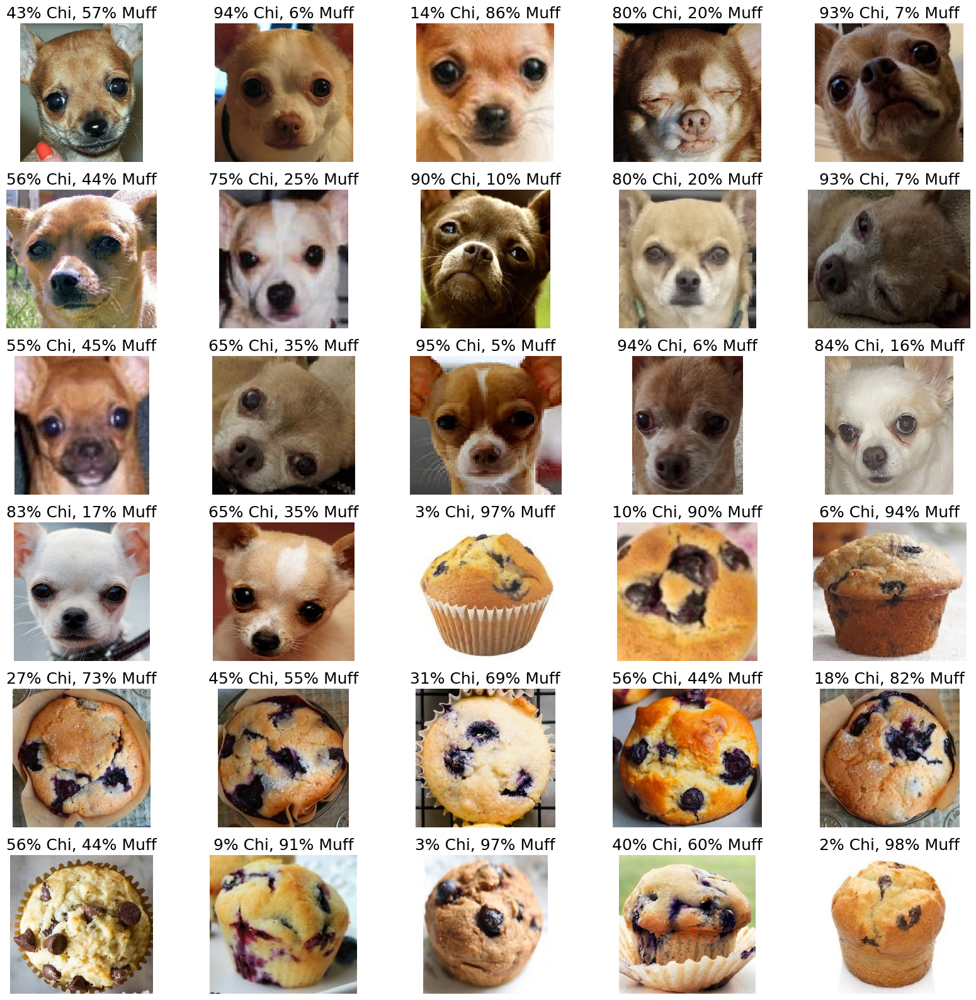
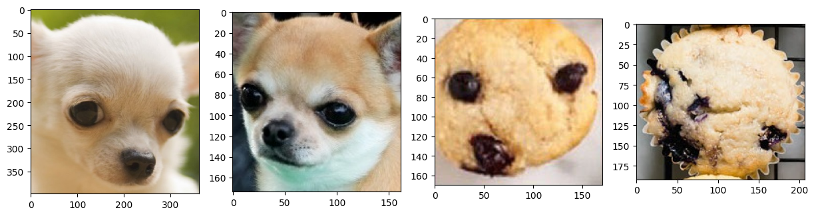
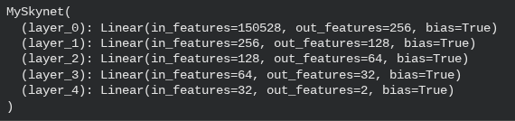
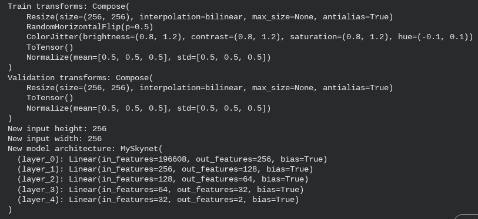

# Neural Networks: Chihuahua vs. Muffin




## Project Overview
**Module:** 06 - Introduction to Neural Networks

**Model:** Multi-Layer Perceptron (MLP) / Feed-Forward Network

**Task:** Binary Classification (Chihuahua vs. Muffin)

This project serves as a foundational exploration into **Neural Networks**. Before implementing advanced Convolutional Networks (CNNs), it is critical to understand how standard Feed-Forward Networks handle image data. In this project, I constructed a **Multi-Layer Perceptron (MLP)** to solve the challenging "Chihuahua vs. Muffin" classification problem, highlighting the capabilities and limitations of using dense layers for processing visual data.

## Problem Statement
The "Chihuahua or Muffin" challenge is a famous visual test where the two classes share significant similarities in color, texture, and shape.
* **The Challenge:** Standard Neural Networks require input data to be **flattened** (converted from a 2D image to a 1D vector). This process destroys spatial information (e.g., the arrangement of eyes relative to the nose).
* **The Goal:** To train a dense neural network to distinguish between these confusing classes solely based on pixel intensity patterns, without the benefit of convolutional feature extraction.

## Approach & Methodology

### 1. Data Preprocessing
* **Flattening:** Converted 2D images (Height $\times$ Width) into 1D vectors to feed into the Dense input layer.
* **Normalization:** Scaled pixel values to the [0, 1] range to ensure stable gradient descent.
* **Label Encoding:** Converted categorical labels (Chihuahua/Muffin) into binary format (0/1).
* **Vector Output:** [View Sample Output Data](Results-&-Visualizations/Dataloader_Outputs_Vector_(0-1).txt)

### 2. Model Architecture (MLP)
I designed a Feed-Forward Neural Network using **TensorFlow/Keras**:
* **Input Layer:** Matches the size of the flattened image vector.
* **Hidden Layers:** Fully Connected (Dense) layers with **ReLU** activation functions to introduce non-linearity.
* **Output Layer:** Single neuron with **Sigmoid** activation for binary classification probability.

## Results & Visualizations

### Sample Predictions
Below are examples of the model attempting to classify the images after training.


### Part IV: Personal Experiments
I conducted 5 distinct experiments to optimize the network, ranging from hyperparameter tuning to architecture modification.

#### Experiment 1: Hyperparameter Tuning (Parts 1-3)
These initial sub-experiments tested specific training variables against the baseline.

* **1.1 Optimizer (SGD vs Adam):** **[View Log](Results-&-Visualizations/1_Part_1_Experiment_with_hyperparameters.txt)**
    * **Result:** Accuracy stalled at **50.83%**.
    * **Finding:** SGD failed to converge on this sparse data compared to Adam.


* **1.2 Activation Function (Tanh):** **[View Log](Results-&-Visualizations/1_Part_2_Experiment_with_hyperparameters.txt)**
    * **Result:** Accuracy dropped to **49.17%**.
    * **Finding:** Tanh likely caused vanishing gradients in the deeper dense layers.


* **1.3 Learning Rate (High LR):** **[View Log](Results-&-Visualizations/1_Part_3_Experiment_with_hyperparameters.txt)**
    * **Result:** Accuracy stalled at **50.83%**.
    * **Finding:** A high learning rate prevented the model from settling into a loss minimum.


#### Experiment 2: Modify Network Architecture
I modified the physical structure of the network (adding/removing hidden layers) to test model capacity.
* **Observation:** Deeper networks struggled with overfitting given the small dataset size.


#### Experiment 3: Image Size & Data Augmentation
I experimented with changing the input resolution and applying augmentations (rotations/flips) to increase dataset diversity.


#### Experiment 4: Retrain and Evaluate
**[View Experiment Log](Results-&-Visualizations/4_Retrain_and_evaluate.txt)**
* **Goal:** Restore the "Baseline" settings (Adam, ReLU, standard LR) to confirm the model could recover.
* **Result:** Accuracy recovered to **69.17%**, proving the architecture was fundamentally sound.


#### Experiment 5: Repeat and Iterate (Optimization Loop)
The final phase involved iterative improvements to push the accuracy higher.

* **5.0 Initial Iteration:** **[View Log](Results-&-Visualizations/5_Repeat_and_iterate.txt)**
    * Baseline accuracy: **70.83%**.
* **5.1 Epoch Extension:** **[View Log](Results-&-Visualizations/5-1_Repeat_and_iterate.txt)**
    * Extended training time. Accuracy dipped to **65.83%** due to overfitting (model memorizing noise).

* **5.2 Regularization:** **[View Log](Results-&-Visualizations/5-2_Repeat_and_iterate.txt)**
    * Added Dropout layers. Accuracy improved to **73.33%** as generalization increased.

* **5.3 Final Model:** **[View Log](Results-&-Visualizations/5-3_Repeat_and_iterate.txt)**
    * Combined best settings. Final Accuracy: **75.00%**.

## Key Findings
1.  **Optimization is Key:** The difference between 50% accuracy (Random) and 75% accuracy (Final) was almost entirely due to Hyperparameter selection (Adam vs SGD) and Regularization (Dropout).
2.  **Overfitting Risks:** Experiment 5.1 showed that simply training *longer* isn't better; it actually hurt performance until Dropout was added in 5.2.
3.  **Architecture Limitations:** As an MLP, the model hit a ceiling around 75%. To go higher, a CNN (Convolutional Neural Network) would be required to capture spatial features.

## Technologies Used
* **Python 3.8+**
* **TensorFlow / Keras:** Neural Network construction.
* **NumPy:** Vector manipulation.
* **Matplotlib:** Plotting loss curves.
* **Pandas:** Data management.

## Datasets Used
* **Chihuahua vs. Muffin**
    * **Project:** Project 06 (Neural Networks) & Project 07 (CNN)
    * **Description:** A challenging binary classification dataset designed to test a model's ability to distinguish between visually similar classes.
    * **Access Instruction:** Clone the dataset directly from the source GitHub repository or download from Kaggle.
    * **Example:**
        ```bash
        !git clone [https://github.com/patitimoner/workshop-chihuahua-vs-muffin](https://github.com/patitimoner/workshop-chihuahua-vs-muffin)
        ```
        
## Project Structure

```text
Project-06-Neural-Networks-Chihuahua-or-Muffin/
├── P06_Neural-Networks-Chihuahua-or-Muffin.ipynb             # Main Code Notebook
├── P06_PF_Neural-Networks-Chihuahua-or-Muffin.pdf            # Project Report (Print Version)
├── J06_RF_Neural-Networks-Chihuahua-or-Muffin.pdf            # Reflection Journal
├── README.md                                                 # Project Documentation
└── Results-&-Visualizations/
    ├── Neural-Networks_Chihuahua_or_Muffin.png               # Project Banner
    ├── 1_Part_1_Experiment_with_hyperparameters.txt             
    ├── 1_Part_2_Experiment_with_hyperparameters.txt           
    ├── 1_Part_3_Experiment_with_hyperparameters.txt            
    ├── 2_Modify_network_architecture.png
    ├── 3_Experiment_with_image_size_and_data_augmentation.png
    ├── 4_Retrain_and_evaluate.txt                                
    ├── 5_Repeat_and_iterate.txt                                
    ├── 5-1_Repeat_and_iterate.txt                                
    ├── 5-2_Repeat_and_iterate.txt                               
    ├── 5-3_Repeat_and_iterate.txt                              
    ├── Dataloader_Outputs_Vector_(0-1).txt                       
    ├── Defined_Neural_Network.png
    ├── Inspect_our_data_Train_Validation.png
    ├── Run_Training.png
    ├── Sample_Images.png
    ├── The_Transforms_into_the_ImageFolder_constructor.png
    └── Transforms_convert_Images_to_Tensors.png
