# CNN: Chihuahua vs. Muffin Classification


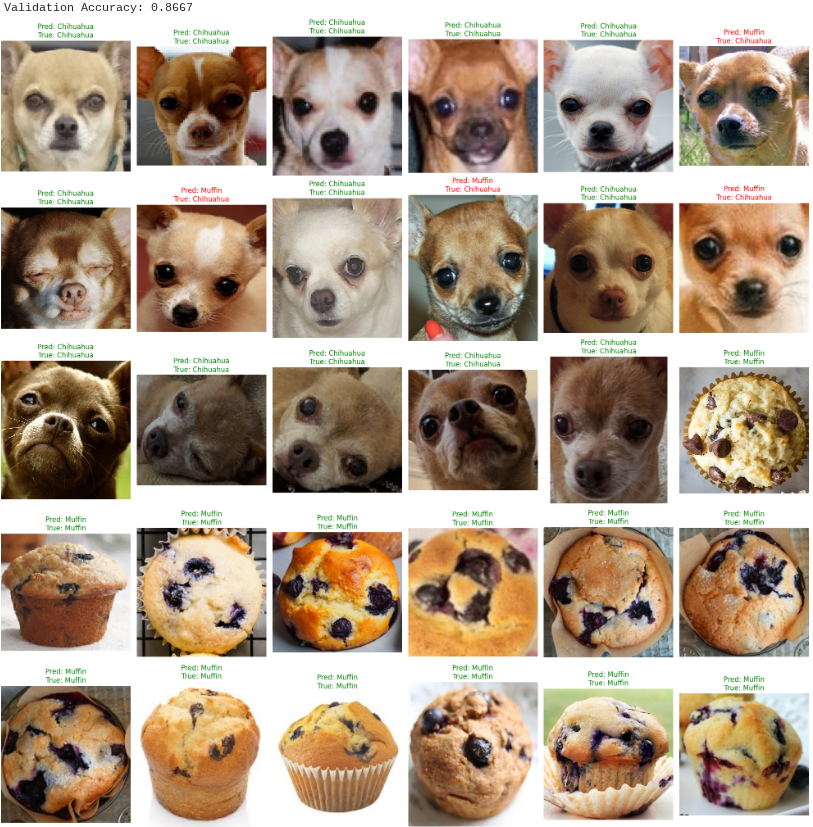

## Project Overview
**Module:** 07 - Convolutional Neural Networks (CNN)  

**Task:** Binary Image Classification  

**Framework:** PyTorch  

This project tackles a classic and humorous computer vision challenge: distinguishing between **Chihuahuas** and **Blueberry Muffins**. While trivial for humans, this task is notoriously difficult for AI because of the high visual similarity between the two classes (similar colors, round shapes, and button-like features representing eyes or blueberries). I built and trained a custom **Convolutional Neural Network (CNN)** to solve this binary classification problem.

## Problem Statement
The primary challenge in this project is **Inter-class Similarity**.
* **Visual Confusion:** The model must learn to distinguish subtle features (e.g., ears, snouts) rather than relying on dominant color blobs, as both classes share similar tan/brown pixel distributions.
* **Overfitting Risk:** With a small dataset and complex model, the network might memorize training data rather than generalizing features.
* **Goal:** To achieve high validation accuracy while maintaining a stable loss curve, proving the model has learned relevant feature maps.

## Approach & Methodology

### 1. Data Preparation & Loading
* **Dataset:** A curated dataset of Chihuahua and Muffin images.
* **Train-Test Split:** Split the data to ensure the model is evaluated on unseen images.
* **PyTorch DataLoader:** Implemented `Dataset` and `DataLoader` classes to handle batching and shuffling efficiently.
* **Preprocessing:** Resized images to a standard dimension and converted them to PyTorch tensors.

### 2. CNN Model Architecture
I defined a custom CNN class inheriting from `nn.Module` containing:
* **Convolutional Layers:** To extract spatial features (edges, textures, shapes).
* **Activation Functions (ReLU):** To introduce non-linearity.
* **Pooling Layers (MaxPooling):** To reduce dimensionality and computation.
* **Fully Connected Layers:** To perform the final binary classification based on extracted features.

### 3. Training & Tuning
* **Training Loop:** Implemented a standard loop using `CrossEntropyLoss` and an Optimizer (`Adam`/`SGD`).
* **Model Tuning:** I experimented with modifying the training function to improve convergence, running the model for extended epochs (up to 10) to observe long-term stability.
* **Monitoring:** Tracked Training Loss vs. Validation Loss across epochs to detect overfitting.

## Results & Visualizations

### 1. Architecture & Setup
Visualizing the pipeline setup before training.

| Dataset Split | Model Definition | DataLoader Setup | Training Config |
|:---:|:---:|:---:|:---:|
|  | 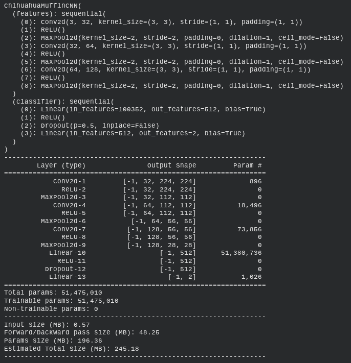 | 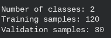 | 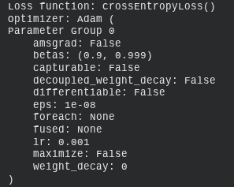 |

### 2. Training Progress (Standard vs. Modified)
Comparing the model's performance over multiple epochs.

| Initial Training (Epochs 1-5) | Extended Training (Epochs 6-10) |
|:---:|:---:|
| 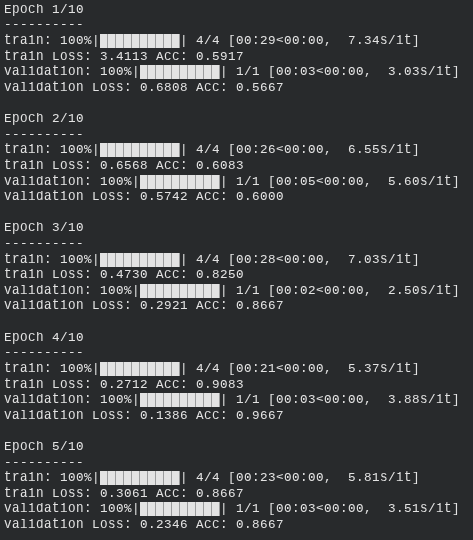 | 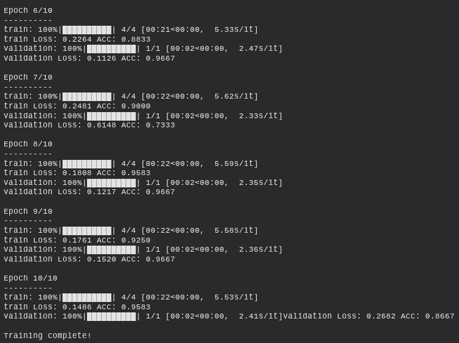 |

| Modified Function (Epochs 1-5) | Modified Function (Epochs 6-10) |
|:---:|:---:|
| 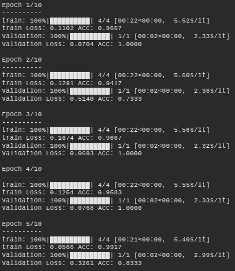 | 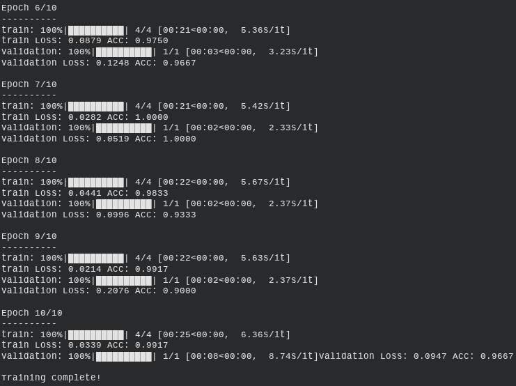 |

### 3. Loss Analysis Curves
Analyzing the gap between Training and Validation loss to check for overfitting.

| Loss Comparison 1 | Loss Comparison 2 |
|:---:|:---:|
| 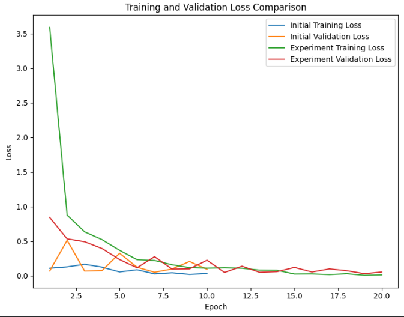 | 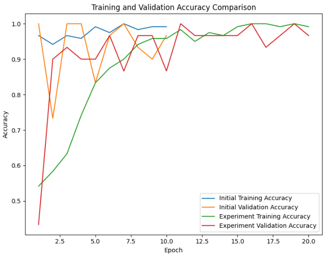 |

| Visualization 1 | Visualization 2 |
|:---:|:---:|
| 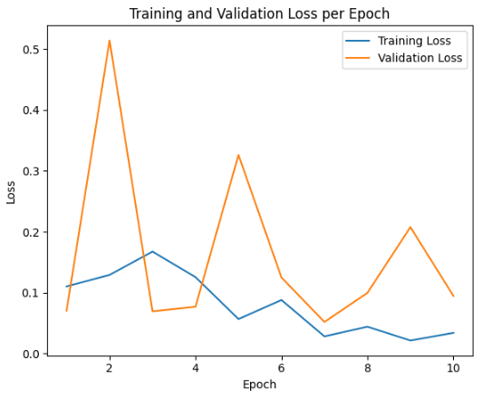 | 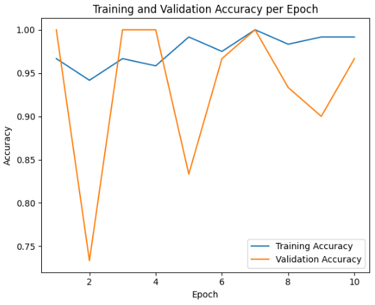 |

### 4. Final Model Evaluation
The model's predictions on test images, demonstrating its ability to distinguish the confusing classes.


*Figure: The model correctly identifying a Chihuahua (Left) and a Muffin (Right), overcoming the visual similarity trap.*

## Dataset Information
This project utilizes a specific image dataset designed to challenge Computer Vision models with visually similar classes.

* **Dataset Name:** Chihuahua vs. Muffin Image Classification
* **Repository:** [workshop-chihuahua-vs-muffin](https://github.com/patitimoner/workshop-chihuahua-vs-muffin)
* **Original Source:** This dataset is popularly available on Kaggle, inspired by the viral "Chihuahua or Muffin" meme.
* **Structure:**
    * `train/`: Contains subfolders `chihuahua` and `muffin` for model training.
    * `test/`: Contains subfolders `chihuahua` and `muffin` for validation/testing.
* **Access Instructions:**
    * **Note:** The dataset is not included directly in this repository to save space.
    * You can clone the data from the link above or download the standard version from [Kaggle](https://www.kaggle.com/datasets/samuelcortinhas/muffin-vs-chihuahua-image-classification).
      
## Key Findings
1.  **Feature Extraction:** The CNN successfully learned to identify "dog-like" features (ears, eyes) vs "food-like" features (texture, lack of symmetry), despite the color similarities.
2.  **Epoch Stability:** Extending training from 5 to 10 epochs (as seen in the "Modified" logs) allowed the model to settle into a more stable loss minimum, though care was needed to avoid overfitting.
3.  **Loss Curves:** The "Visualize Training Progress" charts highlight that while training loss consistently drops, validation loss can fluctuate, indicating the importance of techniques like Dropout or Early Stopping.

## Technologies Used
* **Python 3.8+**
* **PyTorch (torch, torch.nn, torchvision):** Main Deep Learning framework.
* **Matplotlib:** For plotting loss curves and displaying images.
* **Pandas/NumPy:** Data manipulation.
* **Scikit-Learn:** Used for `train_test_split`.

## Project Structure

```text
Project-07-CNN-Chihuahua-or-Muffin/
├── P07_CNN-Chihuahua-or-Muffin.ipynb        # Main PyTorch Notebook
├── P07_PF_CNN-Chihuahua-or-Muffin.pdf       # Project Report
├── J07_RF_CNN-Chihuahua-or-Muffin.pdf       # Reflection Journal
├── README.md                                # Project Documentation
└── Results-&-Visualizations/                # Output Images
    ├── Analyze_Compare_Results_Training_and_Validation_Loss_Comparison_1.png
    ├── Analyze_Compare_Results_Training_and_Validation_Loss_Comparison_2.png
    ├── Data_Preparation_Train-Test Split.png
    ├── Dataset_and_Dataloader.png
    ├── Model_Definition.png
    ├── Model_Evaluation_Chihuahua_and_Muffin.png
    ├── Model_Trainning_Epoch_1-5.png
    ├── Model_Trainning_Epoch_6-10.png
    ├── Modify_The_Training_Function_Epoch_1-5.png
    ├── Modify_The_Training_Function_Epoch_6-10.png
    ├── Training_Setup.png
    ├── Visualize_Training_Progress_Training_and_Validation_Loss_per_Epoch_1.png
    └── Visualize_Training_Progress_Training_and_Validation_Loss_per_Epoch_2.png
