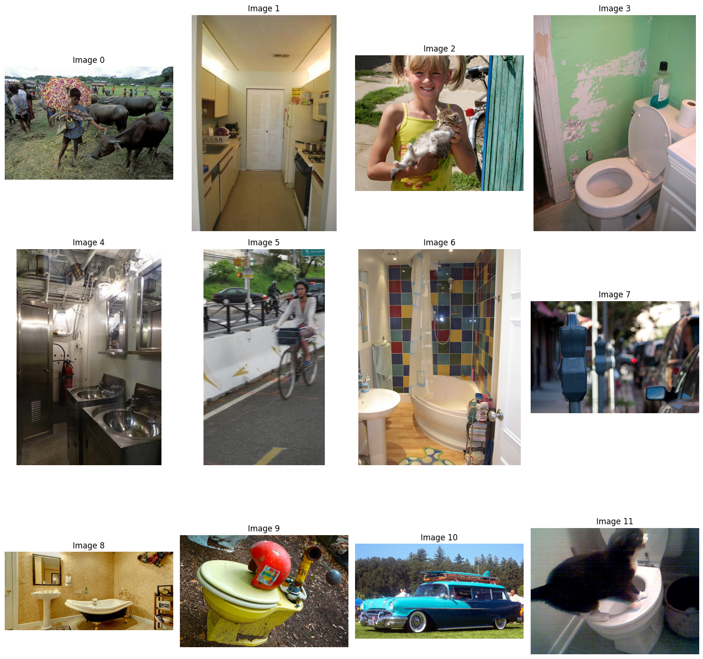
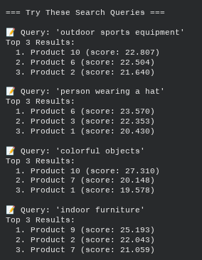
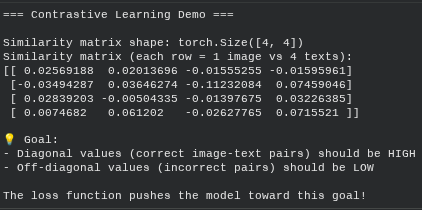
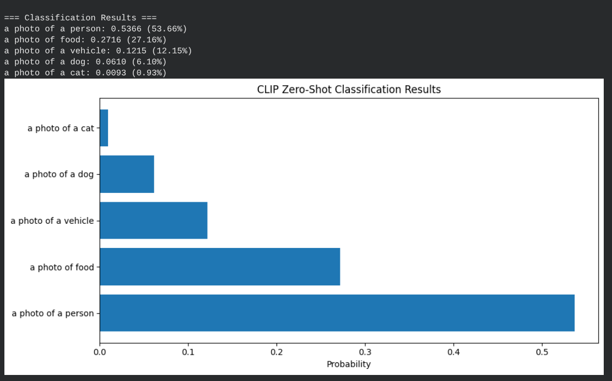
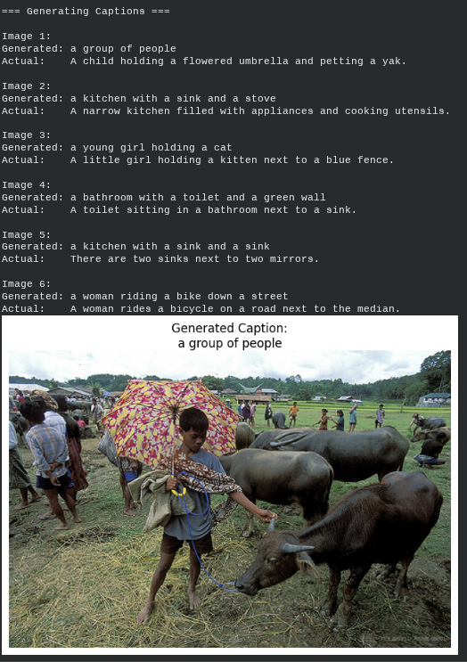
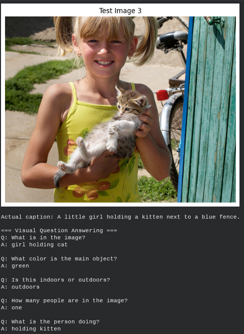
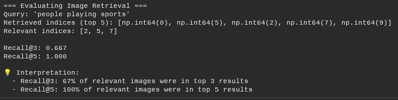
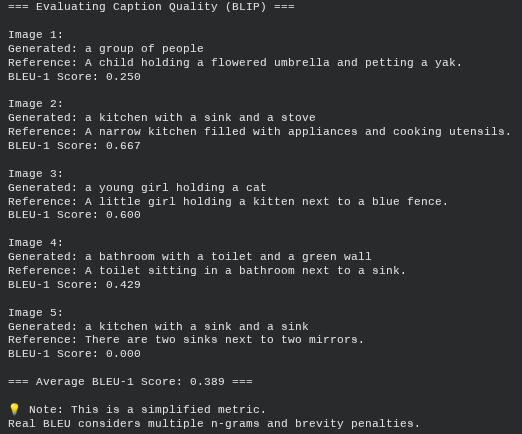
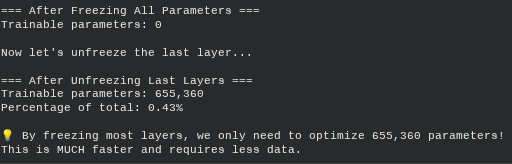

# Visual Language Models (VLMs): Bridging Vision & Text




## Project Overview
**Module:** 09 Visual Language Models

**Focus:** Visual Language Models (CLIP, BLIP)  

This project explores the intersection of Computer Vision (CV) and Natural Language Processing (NLP) using **Visual Language Models (VLMs)**. Unlike traditional models that process images or text in isolation, VLMs learn a shared representation space, enabling advanced capabilities like **zero-shot classification**, **semantic image search**, and **automated image captioning**.

## Problem Statement
In many real-world scenarios, particularly in digital archiving (e.g., museums) or e-commerce, data is unstructured and unlabeled.
* **The Search Problem:** Traditional keyword search fails when metadata is missing. We need to find images using natural language descriptions (e.g., "people playing sports") without manual tagging.
* **The Labeling Problem:** Manually writing descriptions for millions of images is unscalable. We need automated systems to generate accurate, descriptive captions.
* **The Generalization Problem:** Standard classifiers break when they encounter new categories. We need "Zero-Shot" capabilities to classify images the model has never seen before.

## Approach & Methodology

The solution leverages two state-of-the-art VLM architectures implemented via the Hugging Face `transformers` library:

### 1. Contrastive Learning (CLIP)
I used OpenAI's **CLIP (Contrastive Language-Image Pre-training)** to map images and text into a shared vector space.
* **Method:** By calculating the cosine similarity between image embeddings and text embeddings, the model determines how closely a caption matches an image.
* **Application:** Used for Zero-Shot Classification and Image Retrieval.

### 2. Generative Vision-Language (BLIP)
I utilized Salesforce's **BLIP (Bootstrapping Language-Image Pre-training)** for tasks requiring text generation.
* **Method:** This model uses an image encoder and a text decoder to "read" an image and output coherent sentences.
* **Application:** Used for generating captions and Visual Question Answering (VQA).

## Results & Visualizations

### 1. Semantic Image Search
The model successfully retrieved images based on abstract concepts rather than exact file names.



*Figure 1: The model retrieves the correct images for "People playing sports" and "Food on a table" by ranking similarity scores.*

### 2. Zero-Shot Classification & Embeddings
By analyzing the dot product of embeddings, the model distinguished between complex visual concepts without specific training.



*Figure 2: Heatmap showing high correlation (darker red) between matching image-text pairs.*



*Figure 3: Probability distribution showing the model's confidence in classifying an image as "an astronaut" vs "a rocket".*

### 3. Image Captioning Quality (BLIP)
The Generative model produced descriptive captions for unseen images.

| Input Image | Generated Caption |
|:---:|:---:|
|  | *"A child holding a flowered umbrella and petting a yak"* |
|  | *"A little girl holding a kitten next to a blue fence"* |

### 4. Quantitative Evaluation (BLEU & Recall)
I evaluated the models using **BLEU scores** (for caption text overlap) and **Recall@K** (for retrieval accuracy).



*Figure 4: Recall scores measuring how often the correct image was retrieved in the top K results.*



*Figure 5: BLEU scores indicating the linguistic similarity between generated captions and human reference text.*

### 5. Model Efficiency
I analyzed the parameter distribution to understand the computational cost of the VLM.



*Figure 6: Breakdown of trainable parameters in the model architecture.*

## Dataset Information
This project utilizes the **COCO (Common Objects in Context)** dataset for training and evaluation benchmarks.

* **Dataset Name:** COCO (Common Objects in Context)
* **Source:** [https://www.kaggle.com/datasets/awsaf49/coco-2017-dataset](https://www.kaggle.com/datasets/awsaf49/coco-2017-dataset)
* **Access Instructions:**
    * **Note:** The dataset is not included in this repository due to size constraints.
    * You can load the dataset directly using the Hugging Face `datasets` library or `torchvision`:
    ```python
    # Example using Hugging Face Datasets
    from datasets import load_dataset
    dataset = load_dataset("coco", split="validation")
    
    # Example using Torchvision
    import torchvision.datasets as dset
    coco_val = dset.CocoCaptions(root = 'path/to/images',
                                 annFile = 'path/to/annotations.json')
    ```
    
## Key Findings
1.  **Semantic Understanding:** CLIP embeddings capture semantic meaning effectively. Searching for "Animals in nature" retrieves relevant images even if the word "animal" isn't in the metadata.
2.  **Zero-Shot Power:** The model performed surprisingly well on classification tasks it was not explicitly trained for, suggesting high generalization potential.
3.  **Metric Limitations:** While BLEU scores provide a benchmark, they don't always reflect human preference. A caption can be factually correct but have a low BLEU score if the phrasing differs from the reference.
4.  **Business Use Case:** As explored in the lab report, this technology is viable for **Museum Digital Archiving**, allowing curators to search historical artifacts using natural language.

## Technologies Used
* **Python 3.8+**
* **PyTorch** (Deep Learning Backend)
* **Hugging Face Transformers** (CLIP & BLIP models)
* **Scikit-Learn** (Cosine Similarity metrics)
* **NLTK** (BLEU Score evaluation)
* **Matplotlib/Seaborn** (Data Visualization)

## Datasets Used
* **MS COCO (Common Objects in Context)**
    * **Project:** Project 09 (Visual Language Models)
    * **Description:** A large-scale dataset used for benchmarking captioning and zero-shot retrieval tasks.
    * **Access Instruction:** Load using the Hugging Face `datasets` library or `torchvision`.
    * **Example:**
        ```python
        from datasets import load_dataset
        dataset = load_dataset("coco", split="validation")
        ```
        
## Project Structure

```text
Project-09-Visual-Language-Models-(VLMs)/
├── P09_(VLMs)-Visual-Language-Models.ipynb      # Main Jupyter Notebook (Code)
├── P09_PF_(VLMs)-Visual-Language-Models.pdf     # Project Report (Print Format)
├── README.md                                    # Project Documentation
└── Results-&-Visualizations/                    # Output images and plots
    ├── BLEU_Score_Evaluating_Caption_Quality.png
    ├── BLIP_Generate_Caption_01.png
    ├── BLIP_Generate_Caption_02.png
    ├── CLIP_Model_Statistics.png
    ├── CLIP_Zero-Shot_Classification_Results.png
    ├── Image-Text_Similarity_Matrix_(CLIP_Embeddings).png
    ├── Image_Search_Fuction_people_playing_sports_&_Animals_In_Nature.png
    ├── Image_Search_Function_Food_on_a_Table.png
    ├── Parameters_percentage.png
    ├── Recall_Results_score_Evaluating_Image_Retrieval.png
    ├── Search_Queries_Outputs_Results.png
    ├── VLM_Images_set.png
    └── Similarity_Matrix_Contrastive_Learning_Demo.png
