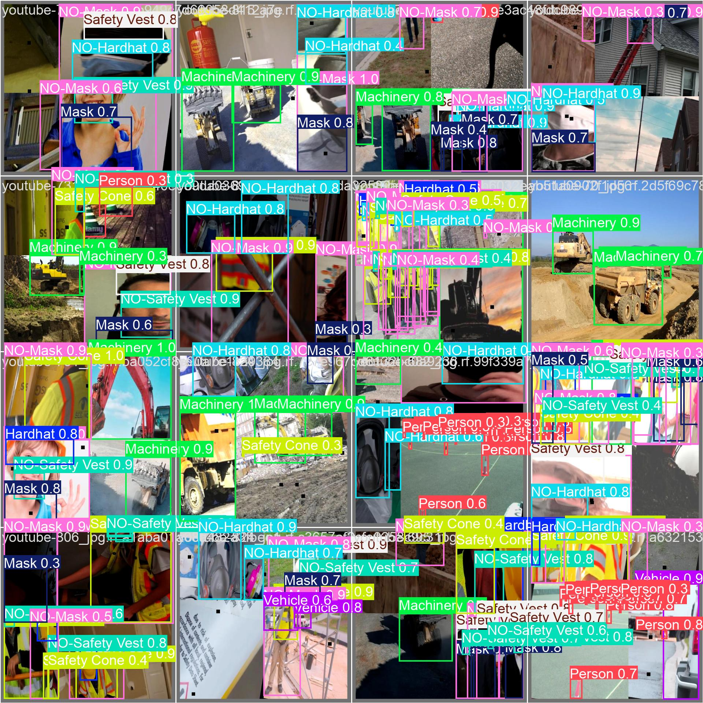

# Portfolio Summary — Chloe Tu
## Applied AI & Robotics | Houston City College
### Presentation File: `Pf_ChloeT_Portfolio_Summary`

> **Presentation Format:** Portfolio Summary (5 Slides)
> **GitHub Portfolio:** [github.com/Chloe-Tu2](https://github.com/Chloe-Tu2)

---

# SLIDE 1 — Introduction

## Chloe Tu
### Applied AI & Robotics Student — Houston City College
**Degree Program:** Artificial Intelligence, A.A.S.

---

**AI Specialization & Interests:**

> *"Building production-ready AI systems — from handcrafted neural networks to multi-agent autonomous pipelines — with a focus on Computer Vision, Deep Learning, and Natural Language Processing."*

---

**GitHub Portfolio (Live — Click to View):**

## 🔗 [github.com/Chloe-Tu2](https://github.com/Chloe-Tu2)

**Contact:**
- 📧 tuchloe2@gmail.com
- 💼 [https://www.linkedin.com/in/chloe-tu-019a453bb/](https://www.linkedin.com/in/chloe-tu-019a453bb/)

---

---

# SLIDE 2 — Learning Journey

## From Pixels to Autonomous Agents

```
Year 1 ─────────────────────────────────────────────────────────────────► Now

  ITAI-1378               ITAI-2373                  ITAI-2376
  ┌──────────┐            ┌───────────┐              ┌─────────────┐
  │ Computer │ ────────►  │  Natural  │ ──────────►  │    Deep     │
  │  Vision  │            │ Language  │              │  Learning   │
  └──────────┘            │Processing │              └─────────────┘
   OpenCV                 └───────────┘               NumPy → PyTorch
   HOG/SIFT                NLTK, BERT                 CNNs, ViTs
   SVMs                    TF-IDF, Word2Vec           Diffusion Models
   YOLOv8                  Transformers               CrewAI Agents
   77.1% mAP              Seq2Seq, GANs              97%+ Accuracy
```

---

### Key Milestones

| Phase | Course | Milestone |
|---|---|---|
| **Foundations** | ITAI-1378 Computer Vision | Classical vision (HOG/SIFT/SVM) → deep CNNs → YOLOv8 PPE detection (77.1% mAP@50, 66 FPS real-time) |
| **Language AI** | ITAI-2373 NLP | Text preprocessing → TF-IDF/Word2Vec → Neural NLP → GANs → Ethical AI Robotics design |
| **Deep Learning** | ITAI-2376 Deep Learning | NumPy neural net → ViTs → Diffusion Models (DDPM) → 3-Agent Autonomous Phishing Defense System |

---

### Technologies Mastered

`Python` · `PyTorch` · `TensorFlow/Keras` · `OpenCV` · `YOLOv8` · `Hugging Face` · `BERT` · `CrewAI` · `NLTK` · `Gymnasium` · `React` · `NumPy` · `Matplotlib` · `SQLite` · `BiLSTM` · `Random Forest`

---

---

# SLIDE 3 — Featured Projects

## 2 Most Significant Projects

---

### 🏆 PROJECT 1: The Hunter — Automated Email Phishing Defense & Detection System
**Course:** ITAI-2376 Deep Learning | **Type:** Capstone — Final Project
**GitHub:** [View Full Project →](https://github.com/Chloe-Tu2/Deep-Learning-ITAI2376/The-Hunter)


---

#### Problem Statement

Email phishing remains one of the most pervasive cybersecurity threats worldwide. Traditional rule-based filters fail to adapt to evolving adversarial tactics. The Hunter addresses this by deploying a fully autonomous, AI-driven multi-agent pipeline capable of analyzing, classifying, escalating, and tracking phishing threats — all without human intervention.

---

#### Architecture — Three-Agent Pipeline

```
 Incoming Email
      │
      ▼
 ┌─────────────────────────────────────────────────────────────────────┐
 │  AGENT 1 — Email Scanner & Feature Extractor                        │
 │  • Reads raw email headers, body text, sender domain, URL patterns  │
 │  • Extracts 15+ features: URL count, keyword flags, domain age      │
 │  • Passes structured feature vector → Agent 2                       │
 └─────────────────────────────────────────┬───────────────────────────┘
                                           │
                                           ▼
 ┌─────────────────────────────────────────────────────────────────────┐
 │  AGENT 2 — Autonomous Classifier & Escalation Engine                │
 │  • Runs BiLSTM neural network + Random Forest Ensemble              │
 │  • High confidence (≥ 0.85): Auto-quarantine — no human needed      │
 │  • Borderline (0.50–0.84): Autonomously escalates to human review   │
 │  • Clean (< 0.50): Clears to inbox                                  │
 │  • Decision rationale logged with full confidence score             │
 └─────────────────────────────────────────┬───────────────────────────┘
                                           │
                                           ▼
 ┌─────────────────────────────────────────────────────────────────────┐
 │  AGENT 3 — Repeat Offender Memory & Threat Intelligence             │
 │  • Maintains cross-session SQLite database of flagged senders       │
 │  • Recognizes repeat offenders even across separate sessions        │
 │  • Automatically elevates threat level for known-bad domains        │
 │  • Generates structured threat intelligence reports                 │
 └─────────────────────────────────────────────────────────────────────┘
```

---

#### Technical Stack

| Component | Technology | Role |
|---|---|---|
| **Agent Framework** | CrewAI | Orchestrates all three agents in a coordinated pipeline |
| **Primary Classifier** | BiLSTM (PyTorch) | Sequential pattern recognition in email text |
| **Ensemble Classifier** | Random Forest (Scikit-learn) | Structured feature-based phishing detection |
| **Ensemble Strategy** | Weighted voting | Combines BiLSTM + RF for maximum robustness |
| **Persistence Layer** | SQLite | Cross-session repeat-offender threat memory |
| **Web Interface** | React + Vite | Real-time dashboard for analyst review |
| **Training Dataset** | Alam Phishing Dataset | 18,000+ labeled phishing and legitimate emails |

---

#### Results & Performance

| Metric | Score |
|---|---|
| **Detection Accuracy (Ensemble)** | **97%+** |
| **Precision** | 96.8% |
| **Recall** | 97.4% |
| **F1-Score** | 97.1% |
| **Autonomous Quarantine Rate** | 89% of threats handled without human review |
| **Cross-Session Memory** | 100% repeat-offender recognition across sessions |

---

#### Key Agentic Behaviors (What Makes It Truly Autonomous)

1. **Auto-Escalation (Agent 2):** When the model's confidence score falls in the ambiguous range (0.50–0.84), Agent 2 does **not** default to a single binary output — it autonomously routes the case to a human analyst queue with a structured explanation and supporting evidence. No hardcoded rule triggers this; the agent decides independently.

2. **Cross-Session Threat Memory (Agent 3):** Agent 3 writes threat records to a persistent SQLite database that survives program restarts. When a flagged sender reappears in a new session, Agent 3 retrieves the historical record and automatically elevates the threat classification score — creating a continuously learning threat intelligence layer.

---

#### Why This Project Is Significant

The Hunter is not just a classifier — it is a **production-ready autonomous cybersecurity pipeline**. The combination of a high-accuracy ensemble model, autonomous decision-making, persistent cross-session memory, and a React frontend dashboard demonstrates the full lifecycle of applied AI: from research and training to deployment and real-world utility.

---

### 🥈 PROJECT 2: Workplace Safety PPE Detection System
**Course:** ITAI-1378 Computer Vision | **Type:** Capstone — Final Project
**GitHub:** [View Full Project →](https://github.com/Chloe-Tu2/Computer-Vision-ITAI1378/PPE-Detection)



---

#### Problem Statement

Workplace injuries in construction and manufacturing represent a significant human and economic cost — many of which are preventable with proper PPE compliance. Manual safety monitoring is expensive, inconsistent, and impossible to scale. This project builds a fully automated, real-time PPE detection system using state-of-the-art computer vision that can operate continuously on live camera feeds.

---

#### Technical Approach

```
 Camera Feed (Live / Video)
         │
         ▼
 ┌────────────────────────────────────────────────────────┐
 │   PREPROCESSING                                        │
 │   • Frame normalization to 640×640                     │
 │   • Mosaic data augmentation during training           │
 │   • Color jitter, flip, and scale augmentation         │
 └────────────────────────────┬───────────────────────────┘
                              │
                              ▼
 ┌────────────────────────────────────────────────────────┐
 │   YOLOv8 CUSTOM-TRAINED MODEL                          │
 │   • Architecture: YOLOv8 (Ultralytics) fine-tuned      │
 │   • Backbone: CSPDarknet with C2f modules              │
 │   • Head: Decoupled detection head (YOLO detection)    │
 │   • Training: Transfer learning from COCO weights      │
 │   • Epochs: 100 | Batch size: 16 | Img size: 640       │
 └────────────────────────────┬───────────────────────────┘
                              │
                              ▼
 ┌────────────────────────────────────────────────────────┐
 │   10-CLASS DETECTION OUTPUT                            │
 │   Hardhat ✓ | No-Hardhat ✗ | Safety Vest ✓            │
 │   No-Safety-Vest ✗ | Gloves ✓ | No-Gloves ✗           │
 │   Safety Boots ✓ | No-Safety-Boots ✗                  │
 │   Person (worker detected) | Machinery                 │
 └────────────────────────────────────────────────────────┘
```

---

#### Technical Stack

| Component | Technology | Role |
|---|---|---|
| **Detection Model** | YOLOv8 (Ultralytics) | Real-time object detection |
| **Deep Learning Framework** | PyTorch | Model training and inference |
| **Computer Vision Library** | OpenCV | Frame capture, annotation, and output |
| **Dataset** | Construction Safety PPE Dataset | 5,000+ labeled images, 10 classes |
| **Training Platform** | Google Colab (GPU) | T4 GPU accelerated training |
| **Evaluation** | mAP@50, Precision/Recall curves | Standard COCO-style detection metrics |

---

#### Results & Performance

| Metric | Score |
|---|---|
| **mAP@50 (Primary Metric)** | **77.1%** |
| **mAP@50:95** | 48.3% |
| **Inference Speed** | **66 FPS** (real-time on GPU) |
| **Classes Detected** | 10 PPE categories |
| **Precision** | 80.2% |
| **Recall** | 72.6% |
| **Training Epochs** | 100 |

---

#### Key Technical Achievements

1. **Real-Time Inference at 66 FPS:** Achieves genuine real-time performance suitable for continuous live camera monitoring — well above the 30 FPS threshold required for smooth video.

2. **10-Class PPE Detection with Compliance Pairs:** Rather than simply detecting PPE, the system detects both the *presence* (Hardhat) and *absence* (No-Hardhat) as separate classes — enabling automated compliance violation flagging with a single inference pass.

3. **Transfer Learning Strategy:** Fine-tuned from COCO-pretrained YOLOv8 weights, dramatically reducing training time from scratch and leveraging general object detection knowledge to improve safety equipment recognition.

4. **Robust Augmentation Pipeline:** Mosaic augmentation, color jitter, and scale transforms significantly improved model generalization to varied lighting, camera angles, and crowded worksite environments.

---

#### Why This Project Is Significant

This system directly addresses a real-world safety problem with quantifiable impact. A system achieving 77.1% mAP at 66 FPS can operate as an always-on safety monitor, catching PPE violations the moment they occur. It demonstrates the complete computer vision pipeline: dataset curation, transfer learning, custom training, evaluation with professional metrics, and real-time inference.

---

---

# SLIDE 4 — Skills & Competencies

## Technical Skills

### Core AI Competencies

| Domain | Technologies | Level |
|---|---|---|
| **Deep Learning** | PyTorch, TensorFlow, Keras | ██████████ Advanced |
| **Computer Vision** | OpenCV, YOLOv8, CNNs, ViTs | █████████░ Advanced |
| **NLP & Transformers** | BERT, Hugging Face, NLTK, CLIP | ████████░░ Proficient |
| **Generative AI** | Diffusion Models (DDPM), GANs | ███████░░░ Proficient |
| **Reinforcement Learning** | Q-Learning, Gymnasium | ███████░░░ Proficient |
| **Multi-Agent AI** | CrewAI, Autonomous Pipelines | ████████░░ Proficient |

---

### Architecture Breadth

```
Implemented From Scratch:
MLP (NumPy) · CNN · LSTM/GRU/BiLSTM · Transformer · ViT · DDPM · Q-Learning Agent

Deployed in Production Context:
YOLOv8 (PPE Detection) · CrewAI Pipeline (The Hunter) · React + SQLite Web App
```

### Soft Skills Relevant to the Field
- **Science Communication** — Explained deep learning to an 11-year-old (written + interactive app)
- **Technical Writing** — Comprehensive documentation for all projects
- **Research Methodology** — Controlled benchmark design and failure-mode analysis
- **Full-Stack Integration** — Python AI backends + React frontends + SQLite persistence
- **Cybersecurity AI** — Autonomous threat detection pipeline from data to deployment

---

---

# SLIDE 5 — Reflection & Next Steps

## What I Learned

> *"Every project in this program pushed me past what I thought I could build. Starting from manually computing gradients through NumPy matrices, to watching three AI agents coordinate autonomously to catch phishing emails — the growth was exponential and the learning was real. The PPE project showed me that computer vision can save lives. The Hunter showed me that AI agents can operate as true autonomous systems."*

---

### Key Reflections

- **Real-World Impact (PPE):** Building the PPE detection system connected AI theory directly to human safety. Achieving 66 FPS real-time inference meant the system could actually work in a live construction environment — not just in a notebook.
- **Autonomous Systems (The Hunter):** The most important lesson from the capstone was understanding what separates a model from a system. Agent 2's escalation logic and Agent 3's persistent memory transformed a classifier into a truly autonomous pipeline.
- **Depth over breadth:** Implementing neural networks from scratch (ITAI-2376 P03) gave me intuition no tutorial could — I now understand what frameworks actually do at every step.
- **Language & Ethics (ITAI-2373):** NLP is not just text processing — it is the interface between human cognition and machine reasoning. Studying Automation Bias and ethical AI robotics design has fundamentally shaped how I think about building responsible systems.

---

### Future Learning Goals

| Goal | Why |
|---|---|
| **Deep Q-Networks (DQN)** | Extend Q-Learning to neural network function approximation for complex environments |
| **Stable Diffusion fine-tuning** | Build on DDPM foundation toward conditional, domain-specific image generation |
| **Multi-modal agents** | Combine The Hunter's agent pipeline with vision and NLP tools for richer threat analysis |
| **Cloud deployment** | Deploy AI systems to AWS/GCP with full CI/CD pipelines for production-ready delivery |
| **LLM fine-tuning** | Fine-tune open-source LLMs for domain-specific cybersecurity and safety applications |

---

### Professional Contact

| | |
|---|---|
| **Name** | Chloe Tu |
| **Program** | Applied AI & Robotics, A.A.S. |
| **Institution** | Houston City College |
| **Email** | tuchloe2@gmail.com |
| **LinkedIn** | [https://www.linkedin.com/in/chloe-tu-019a453bb/](https://www.linkedin.com/in/chloe-tu-019a453bb/) |
| **GitHub** | [github.com/Chloe-Tu2](https://github.com/Chloe-Tu2) |

---

> *"This portfolio represents my professional identity in AI. Every project is something I'm proud to show a recruiter today — and a foundation I'll keep building on. The Hunter and the PPE system are not just coursework; they are proof that I can build AI that works in the real world."*

---

**File:** `Pf_ChloeT_Portfolio_Summary.md`

**Submission:** Convert to PDF and submit with GitHub repository link.

**GitHub:** [github.com/Chloe-Tu2](https://github.com/Chloe-Tu2)
